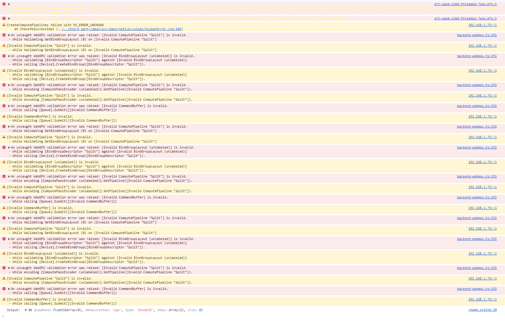

# Error

Code in [src/routes/+page.svelte](src/routes/+page.svelte)

# To run

`yarn dev`

# Model

Model is yolov7-tiny exported to Onnx

https://github.com/WongKinYiu/yolov7?tab=readme-ov-file#export

# Error logs

# Tested devices

| Device                          | OS         | CPU                                | GPU        | Chrome version | Status                           |
| ------------------------------- | ---------- | ---------------------------------- | ---------- | -------------- | -------------------------------- |
| My computer                     | Windows 11 | I9-9900K                           | GTX 3070   | 128.0.6613.114 | No error                         |
| Samsung S20 FE 5G (SM-G781B)    | Android 13 | Qualcomm SM8250 Snapdragon 865 5G  | Adreno 650 | 128.0.6613.99  | No error                         |
| Samsung Galaxy Tab S8 (SM-X700) | Android 14 | Qualcomm SM8450 Snapdragon 8 Gen 1 | Adreno 730 | 128.0.6613.99  | :warning: $${\color{red}Error}$$ |

My other devices are not supported by WebGPU.
